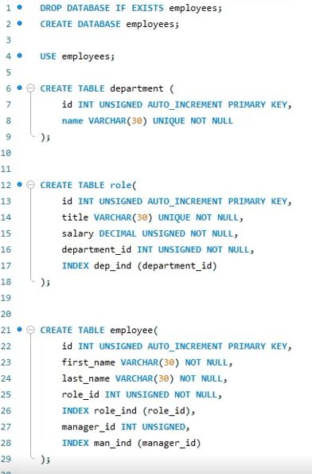
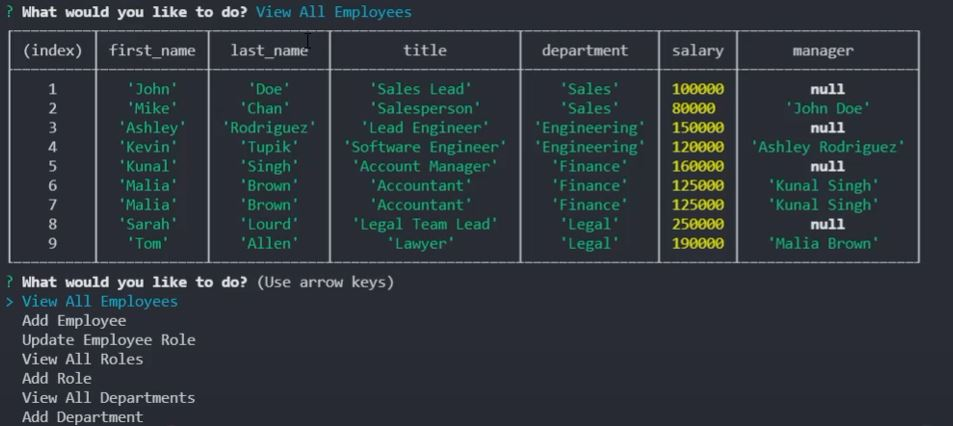

# Employee-Tracker

## Description

This project consists in an Content Management Systems to managing a company's employees. This system allows to: 

* Add departments, roles and employees.
* View departments, roles, employees.
* Update employee roles

The database schema for this project is:

**department**:

  * **id** - INT PRIMARY KEY
  * **name** - VARCHAR(30) to hold department name

**role**:

  * **id** - INT PRIMARY KEY
  * **title** -  VARCHAR(30) to hold role title
  * **salary** -  DECIMAL to hold role salary
  * **department_id** -  INT to hold reference to department role belongs to

**employee**:

  * **id** - INT PRIMARY KEY
  * **first_name** - VARCHAR(30) to hold employee first name
  * **last_name** - VARCHAR(30) to hold employee last name
  * **role_id** - INT to hold reference to role employee has
  * **manager_id** - INT to hold reference to another employee that manages the employee being Created. This field may be null if the employee has no manager

## Technologies

This project was developed using:

* JavaScript
* Node.js
* Inquirer Package
* MySQL Package
* console.table Package
* ASCII-art Logo Package

To install the packages you must write the following npm in the terminal:

```
npm install inquirer
npm install mysql
npm install console.table
npm install asciiart-logo
```

## Mock Up





To see a demonstrative video on how to use the tool, click on the following link: https://drive.google.com/drive/folders/1TDpqyMB2JZwl4M09IIbmPSAHP_KQ_egZ?usp=sharing

